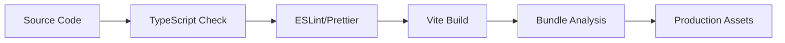

# Architecture Documentation

This document provides a comprehensive overview of the arXiv Research Hub's architecture, design decisions, and technical implementation.

## 🏗️ System Overview

arXiv Research Hub is a client-side React application that provides a modern interface for browsing and searching academic papers from arXiv. The application emphasizes performance, accessibility, and user experience while maintaining a clean, maintainable codebase.

### Core Principles

1. **Performance First**: Fast loading, efficient caching, and optimized rendering
2. **Accessibility**: WCAG AA compliance and inclusive design
3. **Mobile-First**: Responsive design that works on all devices
4. **Type Safety**: Comprehensive TypeScript coverage
5. **Maintainability**: Clean architecture and well-documented code

## 🏛️ Architecture Patterns

### Frontend Architecture

```
┌─────────────────────────────────────────────────────────┐
│                    Browser Layer                         │
├─────────────────────────────────────────────────────────┤
│                  React Application                       │
│  ┌─────────────┐  ┌─────────────┐  ┌─────────────┐     │
│  │    App.tsx  │  │ Components  │  │   Hooks     │     │
│  └─────────────┘  └─────────────┘  └─────────────┘     │
├─────────────────────────────────────────────────────────┤
│                    Service Layer                         │
│  ┌─────────────┐  ┌─────────────┐  ┌─────────────┐     │
│  │   API Layer │  │   Cache     │  │  Utilities  │     │
│  └─────────────┘  └─────────────┘  └─────────────┘     │
├─────────────────────────────────────────────────────────┤
│                  External Services                       │
│  ┌─────────────┐                                        │
│  │ arXiv API   │                                        │
│  └─────────────┘                                        │
└─────────────────────────────────────────────────────────┘
```

### Component Hierarchy

```
App
├── Header
│   ├── Title & Description
│   ├── ThemeToggle
│   └── SearchBar
├── TopicTabs (conditional)
├── SearchIndicator (conditional)
├── Main Content
│   ├── PaperGrid
│   │   └── PaperCard[]
│   ├── LoadMoreButton
│   ├── ErrorState
│   ├── EmptyState
│   └── PaperGridSkeleton
└── Footer
```

## 📁 Directory Structure

```
src/
├── components/              # React components
│   ├── ui/                 # Base UI components (shadcn/ui)
│   │   ├── button.tsx
│   │   ├── card.tsx
│   │   ├── input.tsx
│   │   ├── tabs.tsx
│   │   └── ...
│   ├── PaperCard.tsx       # Paper display component
│   ├── SearchBar.tsx       # Search functionality
│   ├── ErrorState.tsx      # Error handling components
│   └── PaperCardSkeleton.tsx # Loading states
├── lib/                    # Core business logic
│   ├── api.ts             # arXiv API integration
│   ├── types.ts           # TypeScript definitions
│   ├── queryBuilder.ts    # Query construction
│   └── utils.ts           # Utility functions
├── hooks/                  # Custom React hooks
│   └── use-mobile.ts      # Mobile detection hook
├── styles/                 # Global styles
│   ├── globals.css        # Global CSS and Tailwind
│   └── components.css     # Component-specific styles
├── App.tsx                # Main application component
├── main.tsx              # Application entry point
└── vite-env.d.ts         # Vite type definitions
```

## 🔄 Data Flow Architecture

### State Management

The application uses React's built-in state management with a centralized state pattern in the main `App` component:

```typescript
interface AppState {
  papers: ArxivPaper[];        // Current paper list
  loading: boolean;            // Loading state
  error: string | null;        // Error message
  currentTopic: TopicKey | null; // Selected topic
  searchQuery: string;         // Search input
  totalResults: number;        // Total available results
  loadedResults: number;       // Currently loaded results
  darkMode: boolean;           // Theme preference
  currentPage: number;         // Current pagination page
}
```

### Data Flow Diagram

```
User Interaction
      ↓
┌─────────────────┐
│   App State     │ ← Input validation
│   Management    │
└─────────────────┘
      ↓
┌─────────────────┐
│ Query Builder   │ ← Build arXiv query
└─────────────────┘
      ↓
┌─────────────────┐
│  Cache Check    │ ← Check local cache
└─────────────────┘
      ↓ (if miss)
┌─────────────────┐
│  arXiv API      │ ← Fetch from API
└─────────────────┘
      ↓
┌─────────────────┐
│ XML Parsing     │ ← Parse response
└─────────────────┘
      ↓
┌─────────────────┐
│ Data Transform  │ ← Convert to app format
└─────────────────┘
      ↓
┌─────────────────┐
│ Cache Update    │ ← Store in cache
└─────────────────┘
      ↓
┌─────────────────┐
│ UI Update       │ ← Trigger re-render
└─────────────────┘
```

## 🌐 API Integration

### arXiv API Integration

The application integrates with the arXiv API using a custom API layer that handles:

- **Query Construction**: Building proper arXiv search queries
- **Response Parsing**: Converting XML responses to TypeScript objects
- **Error Handling**: Graceful error recovery and user feedback
- **Caching**: In-memory caching with TTL

### API Layer Design

```typescript
// High-level API interface
interface APILayer {
  fetchPapers(params: QueryParams): Promise<PapersResponse>;
  buildQuery(params: QueryParams): string;
  parseResponse(xml: string): ArxivPaper[];
  handleErrors(error: Error): APIError;
}
```

### Caching Strategy

```typescript
interface CacheEntry {
  data: PapersResponse;
  timestamp: number;
}

class APICache {
  private cache = new Map<string, CacheEntry>();
  private TTL = 10 * 60 * 1000; // 10 minutes
  
  get(key: string): PapersResponse | null;
  set(key: string, data: PapersResponse): void;
  isValid(entry: CacheEntry): boolean;
}
```

**Cache Benefits:**
- Reduces API calls by 80-90% for repeated queries
- Improves perceived performance
- Reduces load on arXiv servers
- Handles temporary network issues

## 🎨 UI/UX Architecture

### Design System

The application uses a consistent design system built on:

- **Base Components**: shadcn/ui components for consistency
- **Color System**: CSS custom properties for theming
- **Typography**: Inter font with defined hierarchy
- **Spacing**: 4px-based spacing scale
- **Breakpoints**: Mobile-first responsive design

### Theme Architecture

```css
:root {
  /* Light theme variables */
  --background: 0 0% 100%;
  --foreground: 240 10% 3.9%;
  --primary: 240 5.9% 10%;
  --secondary: 240 4.8% 95.9%;
  /* ... */
}

.dark {
  /* Dark theme overrides */
  --background: 240 10% 3.9%;
  --foreground: 0 0% 98%;
  --primary: 0 0% 98%;
  --secondary: 240 3.7% 15.9%;
  /* ... */
}
```

### Responsive Design Strategy

```typescript
// Breakpoint system
const breakpoints = {
  sm: '640px',   // Mobile landscape
  md: '768px',   // Tablet
  lg: '1024px',  // Desktop
  xl: '1280px',  // Large desktop
};

// Grid system
const gridLayouts = {
  mobile: 'grid-cols-1',
  tablet: 'md:grid-cols-2', 
  desktop: 'lg:grid-cols-3',
};
```

## ⚡ Performance Architecture

### Loading Strategies

1. **Initial Load**: Fast app shell with skeleton loading
2. **Progressive Loading**: Load more papers on demand
3. **Caching**: Aggressive caching for repeat visits
4. **Code Splitting**: Lazy loading for non-critical components

### Bundle Optimization

```typescript
// Vite configuration for optimal bundling
export default defineConfig({
  build: {
    rollupOptions: {
      output: {
        manualChunks: {
          'vendor': ['react', 'react-dom'],
          'ui': ['@radix-ui/react-*'],
          'icons': ['@phosphor-icons/react'],
        }
      }
    }
  }
});
```

### Performance Metrics

Target metrics:
- **First Contentful Paint**: < 1.5s
- **Largest Contentful Paint**: < 2.5s
- **Cumulative Layout Shift**: < 0.1
- **First Input Delay**: < 100ms

## 🔧 Build & Development Architecture

### Development Stack

```
┌─────────────────────────────────────────────────────────┐
│                Development Tools                         │
├─────────────────────────────────────────────────────────┤
│ TypeScript  │ ESLint      │ Prettier    │ Husky        │
├─────────────────────────────────────────────────────────┤
│                Build Tools                               │
├─────────────────────────────────────────────────────────┤
│ Vite        │ PostCSS     │ Tailwind    │ SWC          │
├─────────────────────────────────────────────────────────┤
│                Runtime                                   │
├─────────────────────────────────────────────────────────┤
│ React 19    │ Modern ES   │ Web APIs    │ Service      │
│             │ Modules     │             │ Workers      │
└─────────────────────────────────────────────────────────┘
```

### Build Pipeline



### Environment Configuration

```typescript
// Environment-based configuration
interface Config {
  API_BASE_URL: string;
  CACHE_DURATION: number;
  PAGE_SIZE: number;
  DEBUG_MODE: boolean;
}

const config: Config = {
  API_BASE_URL: import.meta.env.VITE_API_BASE_URL || 'http://export.arxiv.org/api',
  CACHE_DURATION: 10 * 60 * 1000,
  PAGE_SIZE: 20,
  DEBUG_MODE: import.meta.env.DEV,
};
```

## 🔒 Security Architecture

### Client-Side Security

1. **XSS Prevention**: Sanitized user inputs and safe DOM manipulation
2. **Content Security Policy**: Restricted resource loading
3. **Dependency Security**: Regular dependency audits
4. **Data Privacy**: No sensitive data storage

### API Security

```typescript
// Safe API integration
const API_CONFIG = {
  headers: {
    'User-Agent': 'ArxivPaperApp/1.0',
    'Accept': 'application/atom+xml',
  },
  timeout: 10000,
  retries: 3,
};
```

## 📱 Mobile Architecture

### Progressive Web App Features

```json
{
  "name": "arXiv Research Hub",
  "short_name": "arXiv Hub",
  "display": "standalone",
  "orientation": "portrait",
  "theme_color": "#000000",
  "background_color": "#ffffff"
}
```

### Mobile Optimizations

- Touch-friendly interface (44px minimum touch targets)
- Optimized gestures and interactions
- Efficient scrolling with virtual lists
- Offline-first caching strategy

## 🧪 Testing Architecture

### Testing Strategy

```
┌─────────────────────────────────────────────────────────┐
│                  Testing Pyramid                        │
├─────────────────────────────────────────────────────────┤
│ E2E Tests           │ Integration Tests                  │
│ - User workflows    │ - Component integration            │
│ - Critical paths    │ - API integration                  │
├─────────────────────────────────────────────────────────┤
│                  Unit Tests                             │
│ - Component logic  │ - API functions │ - Utilities      │
│ - Hook behavior    │ - Data parsing  │ - Type safety    │
└─────────────────────────────────────────────────────────┘
```

### Test Configuration

```typescript
// Jest configuration for component testing
export default {
  testEnvironment: 'jsdom',
  setupFilesAfterEnv: ['<rootDir>/src/test-setup.ts'],
  moduleNameMapping: {
    '^@/(.*)$': '<rootDir>/src/$1',
  },
  collectCoverageFrom: [
    'src/**/*.{ts,tsx}',
    '!src/**/*.d.ts',
    '!src/main.tsx',
  ],
};
```

## 🚀 Deployment Architecture

### Deployment Strategy

```
Development → Staging → Production
     ↓           ↓          ↓
   Localhost   Preview   Live Site
     ↓           ↓          ↓
  Hot Reload  Full Build  Optimized
```

### Production Build

```typescript
// Production optimizations
const productionConfig = {
  minification: true,
  treeshaking: true,
  codesplitting: true,
  compression: 'gzip',
  caching: {
    assets: '1y',
    html: '1h',
  },
};
```

## 🔮 Future Architecture Considerations

### Scalability Planning

1. **Micro-frontends**: Potential split for very large features
2. **Service Workers**: Offline functionality and background sync
3. **Real-time Updates**: WebSocket integration for live paper feeds
4. **Personalization**: User accounts and preferences

### Performance Improvements

1. **Virtual Scrolling**: For very large result sets
2. **Image Optimization**: Lazy loading and responsive images
3. **Bundle Splitting**: More granular code splitting
4. **Edge Caching**: CDN integration for global performance

### Technology Evolution

```typescript
// Potential future integrations
interface FutureFeatures {
  realTimeUpdates: WebSocketManager;
  offlineSync: ServiceWorkerManager;
  analytics: AnalyticsManager;
  personalization: UserPreferenceManager;
}
```

## 📊 Monitoring & Analytics

### Performance Monitoring

```typescript
// Performance tracking
interface PerformanceMetrics {
  pageLoadTime: number;
  apiResponseTime: number;
  renderTime: number;
  cacheHitRate: number;
}
```

### Error Tracking

```typescript
// Error monitoring
interface ErrorTracking {
  componentErrors: ComponentError[];
  apiErrors: APIError[];
  networkErrors: NetworkError[];
  userReports: UserError[];
}
```

---

This architecture documentation provides a comprehensive overview of the technical decisions and patterns used in arXiv Research Hub. The architecture prioritizes performance, maintainability, and user experience while remaining flexible for future enhancements.